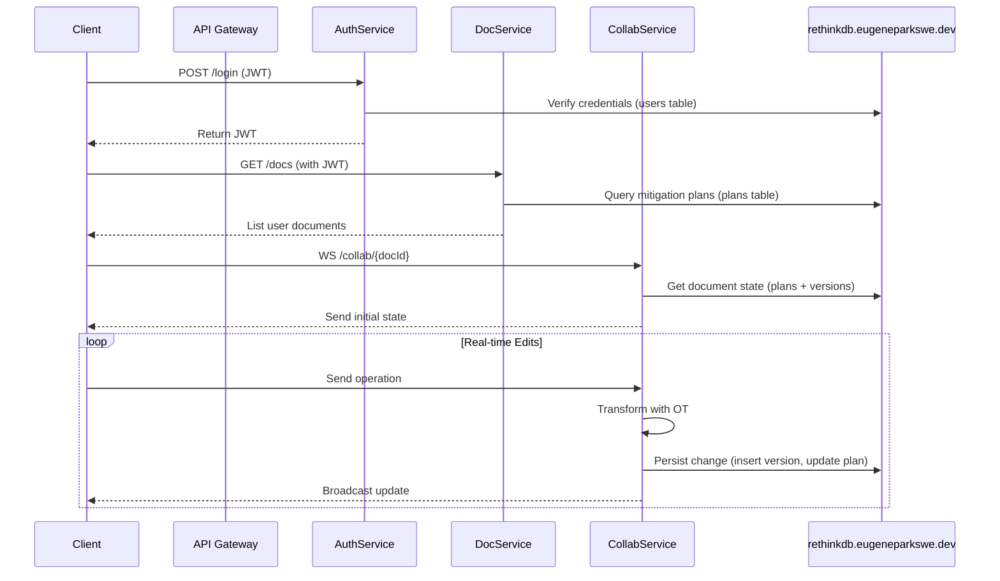

# Collaborative Editing Implementation Plan

## Architecture Overview


## Core APIs

### Authentication Service (RethinkDB-backed)
```http
POST /api/auth/register
Content-Type: application/json
{
  "email": "user@example.com",
  "password": "SecurePass123!"
}
# Server inserts user into RethinkDB 'users' table

POST /api/auth/login
Content-Type: application/json
{
  "email": "user@example.com",
  "password": "SecurePass123!"
}
# Server verifies credentials from RethinkDB 'users' table
```

### Document Service (RethinkDB-backed)
```http
POST /api/documents
Content-Type: application/json
Authorization: Bearer <JWT>
{
  "title": "New Mitigation Plan",
  "content": "Initial content"
}
# Server inserts into RethinkDB 'plans' table

GET /api/documents/{docId}/versions
Authorization: Bearer <JWT>
# Server queries RethinkDB 'versions' table for document history
```

### Collaboration Service (WebSocket)
```json
{
  "type": "operation",
  "docId": "uuid",
  "version": 42,
  "operations": [
    {
      "op": "insert",
      "actionId": "tidal_roar_1",
      "text": "new content",
      "clientId": "abc123"
    }
  ]
}
```

## Data Flow (with RethinkDB)
1. User authentication via JWT, users stored in RethinkDB
2. Document CRUD operations through REST API, plans and versions stored in RethinkDB
3. Real-time collaboration via WebSocket:
   - Operational Transformation (OT) for conflict resolution
   - Version vector for state synchronization
   - Automatic conflict resolution using last-writer-wins with timestamp
   - All edits and versions persisted in RethinkDB

## Implementation Timeline

| Phase | Components | Duration |
|-------|------------|----------|
| 1     | Auth Service, User DB Schema | 3 days |
| 2     | Document Versioning System | 5 days |
| 3     | Operational Transformation Core | 7 days |
| 4     | WebSocket Infrastructure | 4 days |
| 5     | Frontend Integration (React Hooks) | 6 days |

## Security Considerations
- RethinkDB server: `23.240.194.252`
- All backend services (Auth, Document, Collaboration) must connect to this RethinkDB instance.
- End-to-end encryption for WebSocket messages
- Rate limiting on authentication endpoints
- Role-based access control for document sharing
- Session invalidation on JWT expiration